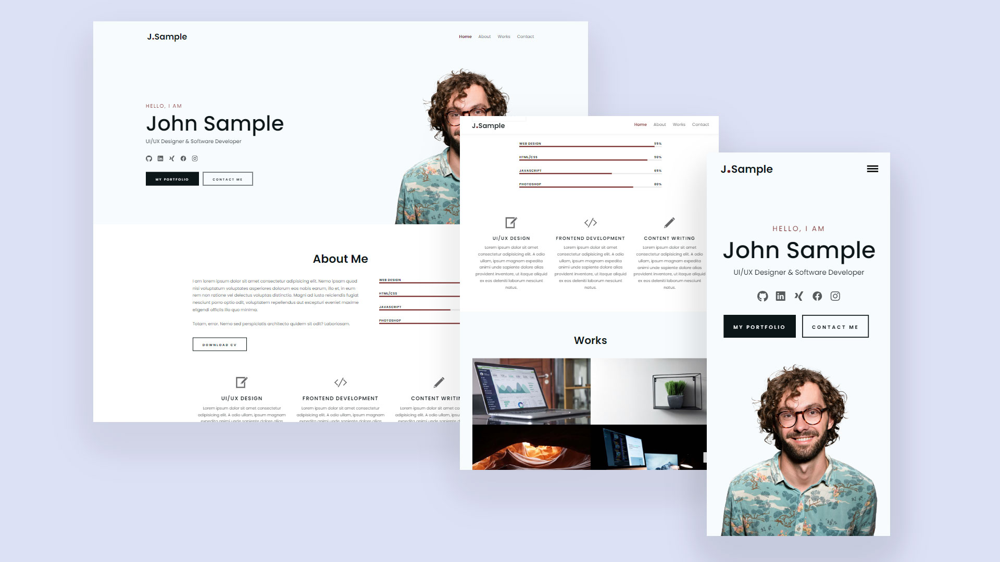

# Sahhar Dhia Eddine - Portfolio Website



## Description

A modern, responsive portfolio website showcasing my work as a Lead / Senior Fullstack Developer. Built with vanilla JavaScript, HTML, and CSS, featuring advanced animations, performance optimizations, and a clean, professional design.

## Table of Contents

- [Features](#features)
- [Live Preview](#live-preview)
- [Technologies Used](#technologies-used)
- [Key Sections](#key-sections)
- [Performance Features](#performance-features)
- [Usage](#usage)
- [Deployment](#deployment)
- [Recent Updates](#recent-updates)
- [License](#license)

## Features

### Core Features
- ✅ **Responsive Design** - Fully responsive across all devices (mobile, tablet, desktop)
- ✅ **Single-page Layout** - Smooth scrolling navigation with active link highlighting
- ✅ **Dark Mode** - Toggle between light and dark themes with preference persistence
- ✅ **Project Filtering** - Filter projects by category (Fullstack, Frontend, Mobile, Open Source)
- ✅ **Project Modals** - Detailed project information in interactive modals
- ✅ **Keyboard Shortcuts** - Navigate using keyboard shortcuts (Alt/Ctrl + H/A/S/P/C/T)
- ✅ **Performance Monitoring** - Core Web Vitals tracking (LCP, FID, CLS)
- ✅ **SEO Optimized** - Structured data (JSON-LD), Open Graph, and Twitter Card meta tags
- ✅ **Accessibility** - ARIA labels, skip links, focus states, and keyboard navigation

### UI/UX Features
- ✅ **Smooth Animations** - AOS (Animate On Scroll) library integration
- ✅ **Typing Animation** - Animated hero section with typing effect
- ✅ **Loading States** - Skeleton loaders for images
- ✅ **Error Handling** - Error boundaries for images and JavaScript errors
- ✅ **Scroll Progress** - Visual scroll progress indicator
- ✅ **Page Loader** - Elegant page loading animation
- ✅ **Hover Effects** - Enhanced micro-interactions throughout
- ✅ **Print Stylesheet** - Optimized printing styles

### Sections
- **Hero Section** - Introduction with typing animation
- **About Me** - Professional experience, technical expertise, education
- **Skills** - Detailed skills section with animated progress bars
- **Projects** - Portfolio showcase with filtering and modals
- **Testimonials** - Client testimonials
- **Experience Timeline** - Visual timeline of work experience
- **Statistics** - Animated counters for achievements
- **Contact** - Contact form with validation and PHP integration
- **Footer** - Quick links, social media, and resources

## Live Preview

Check out the live portfolio: [portfolio-dhia13.vercel.app](https://portfolio-dhia13.vercel.app/)

## Technologies Used

### Frontend
- HTML5
- CSS3 (Custom Properties, Flexbox, Grid)
- Vanilla JavaScript (ES6+)
- AOS (Animate On Scroll) Library

### Backend Integration
- PHP Mailer (for contact form)

### Tools & Libraries
- AOS - Animation library
- PHPMailer - Email handling

## Key Sections

### 1. Hero Section
- Animated typing effect for name and title
- Social media links
- Call-to-action buttons

### 2. About Section
- Professional experience details
- Technical expertise breakdown
- Education and languages
- Downloadable CV

### 3. Skills Section
- Categorized skills (Frontend, Backend, Databases, Mobile, DevOps)
- Animated progress bars
- Skill proficiency levels

### 4. Projects Section
- Filterable project grid
- Project badges (Live, Freelance, Open Source)
- Detailed project modals
- Technology tags

### 5. Contact Section
- Contact information
- Validated contact form
- Real-time form validation
- Success/error messages

## Performance Features

- **Lazy Loading** - Images load on demand
- **Image Optimization** - Proper alt texts and loading states
- **CSS Optimization** - Minimal, organized stylesheets
- **JavaScript Modules** - Modular code structure
- **Performance Monitoring** - Core Web Vitals tracking
- **Error Boundaries** - Graceful error handling

## Usage

### Local Development

1. **Clone the Repository**:
   ```bash
   git clone <repository-url>
   cd my-portfolio
   ```

2. **Open in Browser**:
   - Simply open `index.html` in your browser
   - Or use a local server:
     ```bash
     # Using Python
     python -m http.server 8000
     
     # Using Node.js
     npx serve
     ```

3. **Customization**:
   - Update `index.html` with your information
   - Modify `css/main.css` for custom styles
   - Update `js/project-modal.js` for project details
   - Replace images in `img/` directory

### Email Integration

To enable email functionality:

1. **Server Requirements**:
   - PHP-enabled server (not supported on GitHub Pages)
   - PHPMailer library

2. **Configuration**:
   - Configure `mail.php` with your email credentials
   - Update SMTP settings in `mail.php`

3. **Testing**:
   - Test form submission on a PHP server
   - Check email delivery

## Deployment

### Recommended Platforms

- **Vercel** - Easy deployment with Git integration
- **Netlify** - Static site hosting
- **GitHub Pages** - Free hosting (note: PHP won't work)
- **Traditional Hosting** - Any PHP-enabled server

### Deployment Steps

1. **Prepare Files**:
   - Ensure all assets are included
   - Test locally

2. **Deploy**:
   - Push to GitHub
   - Connect to Vercel/Netlify
   - Or upload to hosting server

3. **Configure**:
   - Update domain in meta tags
   - Configure email settings (if using PHP)
   - Set up analytics (optional)

## Recent Updates

### Latest Features (2024)
- ✨ Added project filtering by category
- ✨ Implemented keyboard shortcuts for navigation
- ✨ Enhanced animations and micro-interactions
- ✨ Added image loading states and error handling
- ✨ Integrated performance monitoring
- ✨ Improved form validation with real-time feedback
- ✨ Added structured data for SEO
- ✨ Enhanced accessibility features
- ✨ Added print stylesheet
- ✨ Improved mobile responsiveness
- ✨ Added dark mode support
- ✨ Integrated logo in header

### Performance Improvements
- Optimized image loading with lazy loading
- Added skeleton loaders for better UX
- Implemented error boundaries
- Enhanced animation performance
- Improved Core Web Vitals

## File Structure

```
my-portfolio/
├── index.html          # Main HTML file
├── css/
│   ├── main.css        # Main stylesheet
│   ├── media.css       # Responsive styles
│   ├── print.css       # Print styles
│   └── reset.css       # CSS reset
├── js/
│   ├── main.js         # Main JavaScript
│   ├── form.js         # Form handling
│   ├── skillbar.js     # Skill bar animations
│   └── project-modal.js # Project modal functionality
├── img/                # Images directory
│   ├── works/          # Project images
│   ├── services/       # Service icons
│   ├── social_icons/   # Social media icons
│   └── icons/          # UI icons
├── mail.php            # PHP mail handler
└── README.md           # This file
```

## Browser Support

- Chrome (latest)
- Firefox (latest)
- Safari (latest)
- Edge (latest)
- Mobile browsers (iOS Safari, Chrome Mobile)

## License

This project is licensed under the MIT License.

## Contact

**Sahhar Dhia Eddine**
- Email: dhiakizaro@gmail.com
- Location: Algiers, Algeria
- GitHub: [github.com/dhia13](https://github.com/dhia13)
- LinkedIn: [linkedin.com/in/sahhar-dhia-eddine](https://www.linkedin.com/in/sahhar-dhia-eddine)
- Portfolio: [portfolio-dhia13.vercel.app](https://portfolio-dhia13.vercel.app/)

---

Built with ❤️ by Sahhar Dhia Eddine
